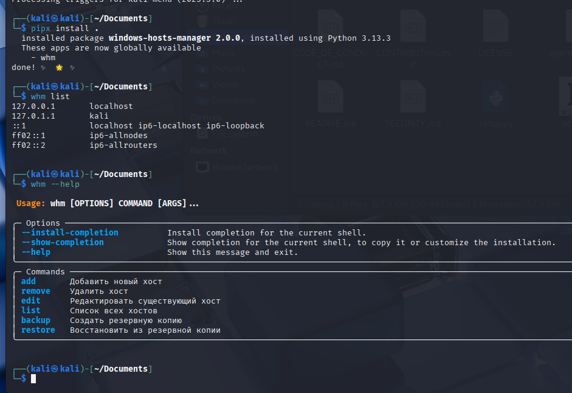
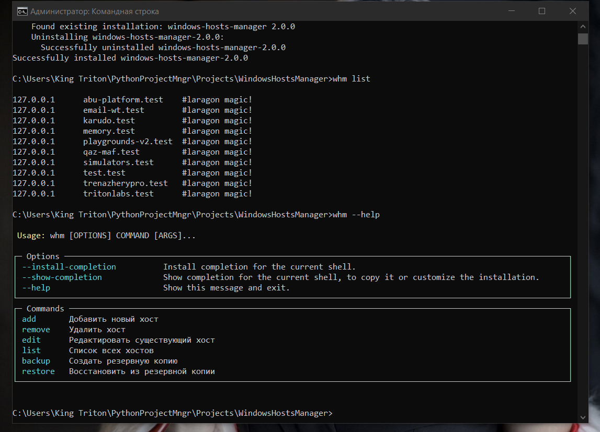

<p align="center">
  
</p>

<h1 align="center">WindowsHostsManager</h1>

<p align="center">
  Кроссплатформенная CLI-утилита для управления файлом <code>hosts</code> в Windows и Linux  
  <br>
  Версия: <strong>2.0.0</strong> • Автор: <strong>King Triton</strong>
</p>

---

## 📘 Описание

**WindowsHostsManager** — это мощная и простая в использовании CLI-утилита для управления системным файлом `hosts`.  
Поддерживает как **Windows**, так и **Linux**, позволяя:

- Добавлять и удалять записи
- Просматривать текущие хосты
- Создавать резервные копии и восстанавливать их
- Работать как через `python`, так и через установленную CLI-команду `whm`

---

## 🧩 Возможности

- **Кроссплатформенность** — одинаково работает в Windows и Linux  
- **Простота** — интуитивно понятные команды  
- **Безопасность** — требует прав администратора или `sudo`  
- **Резервные копии** — автоматическое сохранение и восстановление файла `hosts`  
- **CLI-доступ** — можно вызывать напрямую из терминала (`whm list`, `whm add ...`)  

---

## ⚙️ Требования

- Python **3.8+**
- Для **Windows** — запуск от имени администратора  
- Для **Linux** — запуск через `sudo` (если нужно изменить системный `hosts`)

---

## 🚀 Установка

### Через `pipx` (рекомендуется)
```bash
pip install pipx
pipx install .
````

После установки команда `whm` будет доступна глобально:

```bash
whm list
```

### Локальный запуск

```bash
python cli.py list
```

---

## 💻 Примеры использования

| Команда                         | Описание                        |
| ------------------------------- | ------------------------------- |
| `whm add 127.0.0.1 example.com` | Добавить запись                 |
| `whm remove example.com`        | Удалить запись                  |
| `whm list`                      | Показать все записи             |
| `whm backup`                    | Создать резервную копию         |
| `whm restore`                   | Восстановить из резервной копии |

---

## 🖥️ Скриншоты

### Kali Linux



### Windows 10



---

## 📦 Скачать готовый релиз

Готовые сборки доступны в разделе
👉 [Releases](https://github.com/king-tri-ton/WindowsHostsManager/releases)

---

## ⚖️ Лицензия

Проект распространяется под лицензией [MIT License](LICENSE).

---

## ✉️ Контакт

Автор: **King Triton**
GitHub: [https://github.com/king-tri-ton](https://github.com/king-tri-ton)

---

<p align="center">
  Сделано с заботой о кроссплатформенности 🖤
</p>